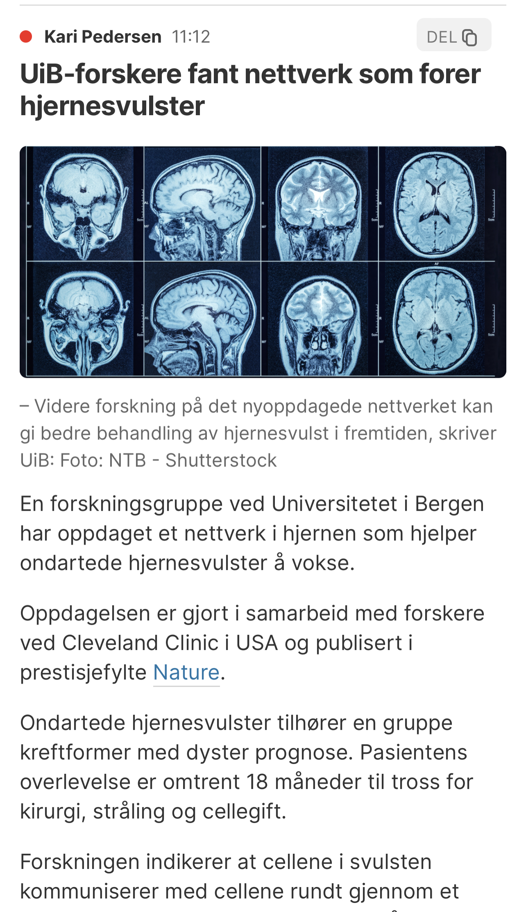
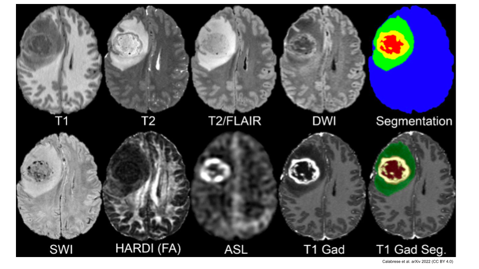
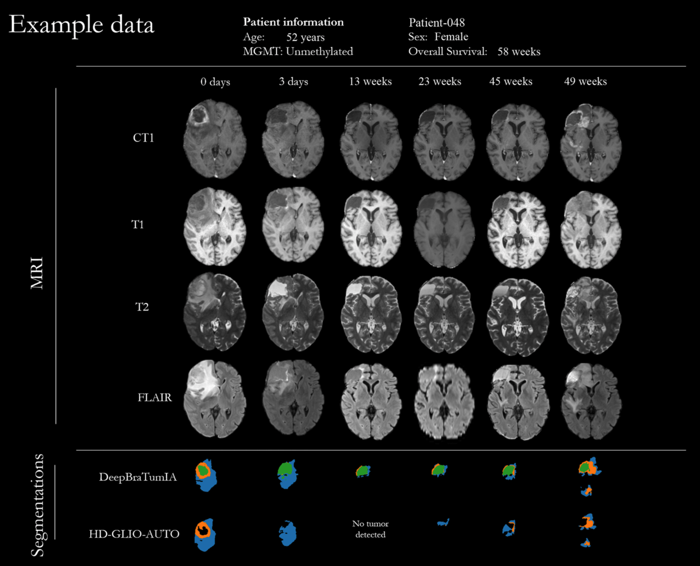
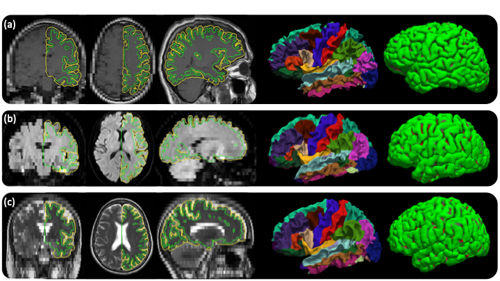
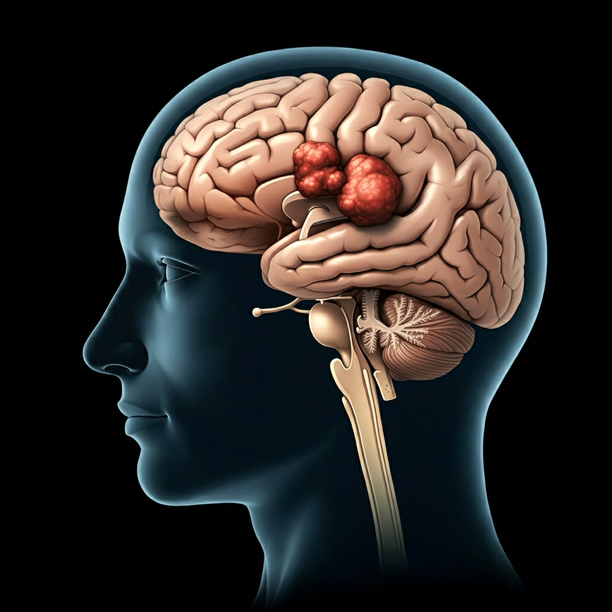
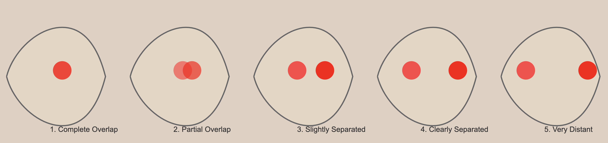

glioma-growth

# Glioma growth

_Segmentation and localization of glioma growth in longitudinal mpMRI recordings_

Code and data derived partly from the manuscript<br>
"**If brain glioblastomas integrate with local neuronal function it is important to know where they grow**" ( 2024-03-19)

Last updated: 2024-11-10

On Overleaf: https://www.overleaf.com/project/65f74b58c8f31530633c2ec2 (restricted access)

-----

## Motivation - Part 1:

Krishna S et al. **Glioblastoma remodelling of human neural circuits decreases survival**. Nature 03 May 2023 (https://www.nature.com/articles/s41586-023-06036-1)

and

**When thinking or talking promotes tumor growth - the mind <-> cancer connect**, Eric Topol 6 May 2023 (https://erictopol.substack.com/p/when-thinking-or-talking-promotes) see also Ibrahim GM, Taylor MD. How thought itself can drive tumour growth. Nature. 2023 May;593(7857):36-37. doi: 10.1038/d41586-023-01387-1. PMID: 33953165.


There were multiple publications in 2019 ([here](https://www.nature.com/articles/s41586-019-1563-y), [here](https://www.nature.com/articles/s41586-019-1564-x) and [here](https://www.nature.com/articles/s41586-019-1576-6))that established the presence of neurogliomal synapses—the direct connection of neurons with glioma tumor cells, which provided the biologic basis for how tumor growth could be enhanced via this connectivity (as schematically shown below).


But that seminal work was significantly expanded in the [[new multi-dimensional study](https://www.nature.com/articles/s41586-023-06036-1)] by Prof Shawn Hervey-Jumper and colleagues at UCSF. With the use of intraoperative brain surface electrode monitoring and performance of cognitive tasks in awake patients with gliomas, this work established the mind-tumor connection.

Examples of the simple cognitive testing. See also Panel B (cognitive assessment) in top Figure of this post for other examples.

<br>


This [schematic](https://www.nature.com/articles/d41586-023-01387-1) highlights the different mechanisms by which cognition could be affected by a brain tumor, with the new study highlighting the importance of panel e, modified brain circuitry. Before the presentation of this work by Krishna and colleagues, it was widely thought that gliomas compromise neurological and cognitive function in one of a few ways: by infiltrating and affecting brain tissue; by compressing adjacent tissue; by inducing swelling around the tumour (Cognitive effects of tumour and surgical treatment in glioma patients in [[4](https://link.springer.com/article/10.1007/s11060-010-0417-0)]; or potentially by competing for blood supply through ‘vascular steal’ (Fig. 1). The authors now reveal a previously unknown mechanism, in which gliomas modify brain circuitry to meet their own needs — by hijacking neuroplasticity through synaptic remodelling and thereby actively altering the architecture of the brain. The ability to capitalize on this induced neuroplasticity enables gliomas to receive extra neuronal signalling and to proliferate.


<br>
Models for cognitive problems associated with brain tumours. The human brain contains regions that are important for language processing, such as an area on the left side of the brain. a–d, Various models have been proposed to explain neurological deficits in people with brain tumours. The tumour might invade or compress tissues, cause swelling in adjacent tissues or reroute blood supply to the tumour. e, Krishna et al. [[2](https://www.nature.com/articles/s41586-023-06036-1)] provide evidence for a model in which brain tumours cause cognitive decline by modifying the neuronal circuitry of the brain. Tumours can form connections called synapses with neurons, and these connections can boost tumour growth when the neurons are actively signalling [[5](https://www.nature.com/articles/s41586-019-1563-y)]. The authors report that activity in regions of the brain involved in a language task also drove activity in tumour-associated regions that do not normally function in language processing. High functional connectivity associated with neuronal signalling in tumours predicts aggressive tumour behaviour, cognitive decline and poor survival. <br>


<br>
_Bergens Tidende, 30 mai 2023_<br>

Watson DC et al. GAP43-dependent mitochondria transfer from astrocytes enhances glioblastoma tumorigenicity. Nature Cancer 2023;4:648–664 [[link](https://www.nature.com/articles/s43018-023-00556-5)]<br>


## Motivation - Part 2:

Access to a large collection of **publicly available ([CC-BY 4.0](https://creativecommons.org/licenses/by/4.0))**, rich, and well characterized multiparametric MRI data related to diffuse glioma
from the University of California San Francisco Preoperative Diffuse Glioma MRI ([UCSF-PDGM](https://wiki.cancerimagingarchive.net/pages/viewpage.action?pageId=119705830)). This repository consists of $501$ adult patients with histopathologically confirmed grade 2-4 diffuse gliomas who were imaged with a standardized 3 Tesla preoperative brain tumor MRI protocol featuring predominantly 3D imaging, as well as advanced diffusion and perfusion imaging techniques. All procedures including imaging, initial tumor resection, and tumor genetic testing at a single medical center between 2015 and 2021. In UCSF-PDGM, a total of $374$ subjects fulfill the WHO 2021 Glioblastoma, IDH-wildtype criteria. 

<br>

Example of multiparametric MRI examination from the UCSF-PDGM dataset. T1: T1-weighted pre-contrast, T2: T2-weighted, T2/FLAIR: T2-weighted FLAIR, DWI: isotropic (trace) diffusion weighted image, SWI: susceptibility-weighted image, HARDI (FA): fractional anisotropy derived from HARDI data, ASL: arterial spin labeling perfusion, T1 Gad: T1-weighted post-contrast, Segmentation: multicompartment tumor segmentation (blue = brain, green = FLAIR abnormality, yellow = enhancing tumor, red = necrotic core), T1 Gad Seg.: tumor segmentation
semitransparent overlay on T1-weighted post-contrast image. We have been using the mpMRI subset {T1, T1 Gad, T2, T2/FLAIR, Segmentation} for the present study.

**Longitudinal data**<br>
" ... Access to fully longitudinal datasets is critical to advance the refinement of treatment response assessment. We release a single-center longitudinal GBM MRI dataset with expert ratings of selected follow-up studies according to the response assessment in neuro-oncology criteria (RANO). The expert rating includes details about the rationale of the ratings. For a subset of patients, we provide pathology information regarding methylation of the O6-methylguanine-DNA methyltransferase (MGMT) promoter status and isocitrate dehydrogenase 1 (IDH1), as well as the overall survival time. The data includes T1-weighted pre- and post-contrast, T2-weighted, and fluid-attenuated inversion recovery (FLAIR) MRI. Segmentations from state-of-the-art automated segmentation tools, as well as radiomic features, complement the data. Possible applications of this dataset are radiomics research, the development and validation of automated segmentation methods, and studies on response assessment. This collection includes MRI data of 91 GBM patients with a total of 638 study dates and 2487 images." (Y. Suter et al. The LUMIERE dataset, Scientific Data 2022;9:768 [[link](https://doi.org/10.1038/s41597-022-01881-7)])

<br>

## Motivation - Part 3:

The recently released [Freesurfer 7.4.1](https://surfer.nmr.mgh.harvard.edu/fswiki/ReleaseNotes) with friends (SynthSeg, SynthSR, and EasyReg) and the [`recon-all-clinical`](https://surfer.nmr.mgh.harvard.edu/fswiki/recon-all-clinical) pipeline script, robust to lesions, artefacts and degradations:

<br>
_Out of the box cortical surface reconstruction and analysis of heterogenous scans. (a) Sagittal T1 scan with .4×.4×6mm resolution. (b)Axial FLAIR scan with 1.7×1.7×6mm resolution. (c) Axial T2-weighted scan with .9×.9×6mm resolution. The WM surface with cortical parcellation overlaid and pial surfaces are also shown._


## See also DeepGlioma
https://github.com/MLNeurosurg/deepglioma

<br>

Bedside SRH and DeepGlioma workflow. a, A patient with a suspected diffuse glioma undergoes surgery for tumor biopsy or surgical resection. The SRH imaging system is portable and imaging takes place in the operating room, performed by a single technician using simple touch screen instructions. A freshly excised tissue specimen is loaded directly into a premade microscope slide and inserted into the SRH imager without the need for tissue processing. Raw SRH images are acquired at two Raman shifts, 2,845cm-1 and 2,930cm-1, as strips. The time to acquire a 3×3mm2 SRH image is approximately 90 seconds. Raw optical images can then be colored using a custom hematox- lyin and eosin (HE) virtual staining method for clinician review. b, DeepGlioma is trained using a multi-modal dataset. First, SRH images are used to train an CNN encoder using weakly supervised, multi-label contrastive learning for image feature embedding. Second, public diffuse glioma genomic data from TCGA, CGGA, and others are used to train a genetic encoder to learn a genetic embedding that represents known co-occurrence relationships between genetic mutations. c, The SRH and genetic encoders are integrated into a single architecture using a transformer encoder for multi-label prediction of diffuse glioma molecular diagnos- tic mutations. We use masked label training to train the transformer encoder. Because our system uses patch-level predictions, spatial heatmaps can be generated for both molecular genetic and molecular subgroup predictions to improve model interpretability, identify regions of variable confidence, and associate SRH image features with DeepGlioma predictions.

---

## Motivation - Part 4: Generative AI

### Gemini Advanced with 1.5 Pro

_https://gemini.google.com/app/e5bfa58fb840bf9b_

_Make an image of a glioblastoma at initial diagnosis and a recurrence after surgery. Use mri as the context._

I'm still learning how to generate certain kinds of images, so I might not be able to create exactly what you're looking for yet. Also, I can't help with photorealistic images of identifiable people, children, or other images that go against my guidelines. If you'd like to ask for something else, just let me know!

_It is not identifiable objects or people, just a glioblastoma_

...

_The previous is better. Please elaborate on that_


<br>


### Claude Sonnet 3.5 (New)

> Or, [Tonyi Lingma](https://plugins.jetbrains.com/plugin/17809-tongyi-lingma--your-ai-coding-assistant-type-less-code-more-) by Alibaba Cloud, or [Baidu's Comate](https://comate.baidu.com/en), or Ant Group's [CodeFuse](https://codefuse.ai), supporting the entire software development lifecycle (e.g. open source GitHub [repos](https://github.com/codefuse-ai); "[Graph-to-Code](https://www.php.cn/faq/745098.html)" for converting design images into code).


_Please make 5 images based on the uploaded figure. Each image should display the intial tumor and with the anterior recurrent tumor at different migration distances from the primary tumor: (1) complete overlapping, (2) partial overlapping, (3) slightly separated, (4) clearly separated, (5) very distant from each other._

```svg
<svg xmlns="http://www.w3.org/2000/svg" viewBox="0 0 1000 200">
  <!-- Common styling for labels -->
  <style>
    .label { font-family: Arial; font-size: 12px; fill: #333; }
  </style>
  
  <!-- Pattern 1: Complete Overlap -->
  <g transform="translate(0, 0)">
    <!-- Brain outline -->
    <path d="M30,100 C40,60 80,20 120,20 C160,20 180,60 190,100 C180,140 160,180 120,180 C80,180 40,140 30,100" 
          fill="#E6D5C3" stroke="#666" stroke-width="2"/>
    <!-- Overlapping tumors -->
    <circle cx="120" cy="90" r="15" fill="#FF4444" opacity="0.7"/>
    <circle cx="120" cy="90" r="15" fill="#FF0000" opacity="0.7"/>
    <text x="100" y="190" class="label">1. Complete Overlap</text>
  </g>

  <!-- Pattern 2: Partial Overlap -->
  <g transform="translate(200, 0)">
    <!-- Brain outline -->
    <path d="M30,100 C40,60 80,20 120,20 C160,20 180,60 190,100 C180,140 160,180 120,180 C80,180 40,140 30,100" 
          fill="#E6D5C3" stroke="#666" stroke-width="2"/>
    <!-- Partially overlapping tumors -->
    <circle cx="115" cy="90" r="15" fill="#FF4444" opacity="0.7"/>
    <circle cx="130" cy="90" r="15" fill="#FF0000" opacity="0.7"/>
    <text x="100" y="190" class="label">2. Partial Overlap</text>
  </g>

  <!-- Pattern 3: Slightly Separated -->
  <g transform="translate(400, 0)">
    <!-- Brain outline -->
    <path d="M30,100 C40,60 80,20 120,20 C160,20 180,60 190,100 C180,140 160,180 120,180 C80,180 40,140 30,100" 
          fill="#E6D5C3" stroke="#666" stroke-width="2"/>
    <!-- Slightly separated tumors -->
    <circle cx="100" cy="90" r="15" fill="#FF4444"/>
    <circle cx="145" cy="90" r="15" fill="#FF0000"/>
    <text x="100" y="190" class="label">3. Slightly Separated</text>
  </g>

  <!-- Pattern 4: Clearly Separated -->
  <g transform="translate(600, 0)">
    <!-- Brain outline -->
    <path d="M30,100 C40,60 80,20 120,20 C160,20 180,60 190,100 C180,140 160,180 120,180 C80,180 40,140 30,100" 
          fill="#E6D5C3" stroke="#666" stroke-width="2"/>
    <!-- Clearly separated tumors -->
    <circle cx="85" cy="90" r="15" fill="#FF4444"/>
    <circle cx="160" cy="90" r="15" fill="#FF0000"/>
    <text x="100" y="190" class="label">4. Clearly Separated</text>
  </g>

  <!-- Pattern 5: Very Distant -->
  <g transform="translate(800, 0)">
    <!-- Brain outline -->
    <path d="M30,100 C40,60 80,20 120,20 C160,20 180,60 190,100 C180,140 160,180 120,180 C80,180 40,140 30,100" 
          fill="#E6D5C3" stroke="#666" stroke-width="2"/>
    <!-- Very distant tumors -->
    <circle cx="70" cy="90" r="15" fill="#FF4444"/>
    <circle cx="170" cy="90" r="15" fill="#FF0000"/>
    <text x="100" y="190" class="label">5. Very Distant</text>
  </g>
</svg>

```

I've created five diagrams showing different patterns of tumor migration, based on the reference image.

<br>

 Each diagram shows:

1. Complete Overlap: The primary and recurrent tumors are in exactly the same location, shown by overlapping red circles
2. Partial Overlap: The tumors share some space but are slightly offset
3. Slightly Separated: A small gap exists between the two tumors
4. Clearly Separated: The tumors are distinctly separated with a notable distance
5. Very Distant: The tumors are at opposite sides of the brain region

In each diagram:
- The darker red represents the primary tumor
- The brighter red represents the recurrent tumor
- The brain outline is shown in a neutral tone for context

Would you like me to modify any aspects of these diagrams, such as:
- The color scheme
- The size of the tumors
- The spacing between positions
- Additional anatomical details<br>


_Please make Python code that quantify features of tumor recurrence, such as size if recurrent tumor (also normalized with size of original tumor), migration distance from original tumor (distances between center of masses, degree of overlap (Dice coefficient), most distant boundary of recurrent tumor to nearest boundary of original tumor (similar to HD95), and any other metric that might be clinical or therapeutical (surgery, radiotherapy, proton-therapy) relevant in case of gliomas._

```python
import numpy as np
from scipy.ndimage import center_of_mass, distance_transform_edt
from scipy.spatial.distance import cdist
from skimage.measure import label, regionprops

class TumorRecurrenceAnalyzer:
    """
    A class to analyze tumor recurrence patterns and compute relevant metrics
    for clinical decision-making in glioma cases.
    """
    
    def __init__(self, original_tumor_mask, recurrent_tumor_mask):
        """
        Initialize with binary masks of original and recurrent tumors.
        
        Parameters:
        -----------
        original_tumor_mask : numpy.ndarray
            Binary mask of the original tumor (0s and 1s)
        recurrent_tumor_mask : numpy.ndarray
            Binary mask of the recurrent tumor (0s and 1s)
        """
        if original_tumor_mask.shape != recurrent_tumor_mask.shape:
            raise ValueError("Tumor masks must have the same dimensions")
            
        self.original_mask = original_tumor_mask.astype(bool)
        self.recurrent_mask = recurrent_tumor_mask.astype(bool)
        
    def compute_volume_metrics(self):
        """
        Calculate volume-related metrics.
        
        Returns:
        --------
        dict
            Dictionary containing volume metrics
        """
        original_volume = np.sum(self.original_mask)
        recurrent_volume = np.sum(self.recurrent_mask)
        
        return {
            'original_volume': original_volume,
            'recurrent_volume': recurrent_volume,
            'volume_ratio': recurrent_volume / original_volume,
            'volume_change': recurrent_volume - original_volume,
            'volume_change_percent': ((recurrent_volume - original_volume) / 
                                    original_volume) * 100
        }
    
    def compute_distance_metrics(self, voxel_spacing=(1,1,1)):
        """
        Calculate distance-related metrics.
        
        Parameters:
        -----------
        voxel_spacing : tuple
            Physical spacing between voxels in each dimension (x,y,z)
            
        Returns:
        --------
        dict
            Dictionary containing distance metrics
        """
        # Calculate centers of mass
        orig_com = np.array(center_of_mass(self.original_mask))
        recur_com = np.array(center_of_mass(self.recurrent_mask))
        
        # Calculate Euclidean distance between centers
        com_distance = np.sqrt(np.sum(((orig_com - recur_com) * voxel_spacing) ** 2))
        
        # Calculate surface distances
        orig_surface = self._get_surface_points(self.original_mask)
        recur_surface = self._get_surface_points(self.recurrent_mask)
        
        if len(orig_surface) > 0 and len(recur_surface) > 0:
            distances = cdist(orig_surface * voxel_spacing, 
                            recur_surface * voxel_spacing)
            min_distance = np.min(distances)
            hd95 = np.percentile(distances.min(axis=1), 95)
        else:
            min_distance = np.nan
            hd95 = np.nan
            
        return {
            'center_of_mass_distance': com_distance,
            'minimum_surface_distance': min_distance,
            'hausdorff_95': hd95
        }
    
    def compute_overlap_metrics(self):
        """
        Calculate overlap-related metrics.
        
        Returns:
        --------
        dict
            Dictionary containing overlap metrics
        """
        intersection = np.logical_and(self.original_mask, self.recurrent_mask)
        union = np.logical_or(self.original_mask, self.recurrent_mask)
        
        intersection_volume = np.sum(intersection)
        dice = (2.0 * intersection_volume) / (np.sum(self.original_mask) + 
                                            np.sum(self.recurrent_mask))
        
        return {
            'dice_coefficient': dice,
            'intersection_volume': intersection_volume,
            'overlap_percentage': (intersection_volume / 
                                 np.sum(self.original_mask)) * 100
        }
    
    def compute_clinical_metrics(self):
        """
        Calculate metrics relevant for clinical decision-making.
        
        Returns:
        --------
        dict
            Dictionary containing clinical metrics
        """
        # Get tumor properties
        orig_props = regionprops(label(self.original_mask))[0]
        recur_props = regionprops(label(self.recurrent_mask))[0]
        
        # Calculate sphericity (1 is perfect sphere, less than 1 is irregular)
        orig_sphericity = self._calculate_sphericity(orig_props)
        recur_sphericity = self._calculate_sphericity(recur_props)
        
        # Calculate margin irregularity
        orig_irregularity = self._calculate_margin_irregularity(self.original_mask)
        recur_irregularity = self._calculate_margin_irregularity(self.recurrent_mask)
        
        return {
            'original_sphericity': orig_sphericity,
            'recurrent_sphericity': recur_sphericity,
            'sphericity_change': recur_sphericity - orig_sphericity,
            'original_margin_irregularity': orig_irregularity,
            'recurrent_margin_irregularity': recur_irregularity,
            'margin_irregularity_change': recur_irregularity - orig_irregularity,
            'multifocal': self._is_multifocal(self.recurrent_mask)
        }
    
    def compute_treatment_relevant_metrics(self):
        """
        Calculate metrics relevant for treatment planning.
        
        Returns:
        --------
        dict
            Dictionary containing treatment-relevant metrics
        """
        # Calculate expansion in each direction for surgical planning
        expansion = self._calculate_directional_expansion()
        
        # Calculate metrics relevant for radiation therapy
        rad_metrics = self._calculate_radiation_metrics()
        
        return {
            'directional_expansion': expansion,
            'radiation_metrics': rad_metrics,
            'surgical_accessibility': self._estimate_surgical_accessibility(),
            'treatment_volume_ratio': self._calculate_treatment_volume_ratio()
        }
    
    def _get_surface_points(self, mask):
        """Extract surface points from binary mask."""
        eroded = mask.copy()
        eroded[1:-1, 1:-1, 1:-1] = mask[1:-1, 1:-1, 1:-1] & \
                                  mask[:-2, 1:-1, 1:-1] & \
                                  mask[2:, 1:-1, 1:-1] & \
                                  mask[1:-1, :-2, 1:-1] & \
                                  mask[1:-1, 2:, 1:-1] & \
                                  mask[1:-1, 1:-1, :-2] & \
                                  mask[1:-1, 1:-1, 2:]
        surface = mask ^ eroded
        return np.array(np.where(surface)).T
    
    def _calculate_sphericity(self, region_props):
        """Calculate tumor sphericity."""
        volume = region_props.area
        surface_area = region_props.perimeter
        if surface_area == 0:
            return 0
        return (np.pi ** (1/3) * (6 * volume) ** (2/3)) / surface_area
    
    def _calculate_margin_irregularity(self, mask):
        """Calculate tumor margin irregularity."""
        dist_transform = distance_transform_edt(mask)
        surface = self._get_surface_points(mask)
        if len(surface) == 0:
            return 0
        surface_distances = dist_transform[surface[:,0], surface[:,1], surface[:,2]]
        return np.std(surface_distances)
    
    def _is_multifocal(self, mask):
        """Check if tumor is multifocal."""
        labeled = label(mask)
        return np.max(labeled) > 1
    
    def _calculate_directional_expansion(self):
        """Calculate tumor expansion in different directions."""
        orig_props = regionprops(label(self.original_mask))[0]
        recur_props = regionprops(label(self.recurrent_mask))[0]
        
        return {
            'anterior_posterior': recur_props.bbox[3] - orig_props.bbox[3],
            'lateral': recur_props.bbox[4] - orig_props.bbox[4],
            'superior_inferior': recur_props.bbox[5] - orig_props.bbox[5]
        }
    
    def _calculate_radiation_metrics(self):
        """Calculate metrics relevant for radiation therapy planning."""
        # Calculate margin needed for coverage
        dist_transform = distance_transform_edt(~self.recurrent_mask)
        margin_95 = np.percentile(dist_transform[self.original_mask], 95)
        
        return {
            'suggested_margin_95': margin_95,
            'original_to_recurrent_margin': self._calculate_treatment_margin()
        }
    
    def _estimate_surgical_accessibility(self):
        """Estimate surgical accessibility based on tumor location and shape."""
        # Simplified metric based on distance from surface and shape complexity
        surface_distances = distance_transform_edt(self.recurrent_mask)
        max_depth = np.max(surface_distances)
        shape_complexity = self._calculate_margin_irregularity(self.recurrent_mask)
        
        # Lower score means more accessible
        return max_depth * shape_complexity
    
    def _calculate_treatment_margin(self):
        """Calculate required treatment margin based on recurrence pattern."""
        dist_transform = distance_transform_edt(~self.original_mask)
        return np.percentile(dist_transform[self.recurrent_mask], 95)
    
    def _calculate_treatment_volume_ratio(self):
        """Calculate ratio of treatment volume to tumor volume."""
        margin = self._calculate_treatment_margin()
        treatment_mask = distance_transform_edt(~self.original_mask) <= margin
        return np.sum(treatment_mask) / np.sum(self.original_mask)

# Example usage:
def analyze_tumor_progression(original_tumor_mask, recurrent_tumor_mask, 
                            voxel_spacing=(1,1,1)):
    """
    Analyze tumor progression patterns comprehensively.
    
    Parameters:
    -----------
    original_tumor_mask : numpy.ndarray
        3D binary mask of original tumor
    recurrent_tumor_mask : numpy.ndarray
        3D binary mask of recurrent tumor
    voxel_spacing : tuple
        Physical spacing between voxels (x,y,z)
        
    Returns:
    --------
    dict
        Dictionary containing all computed metrics
    """
    analyzer = TumorRecurrenceAnalyzer(original_tumor_mask, recurrent_tumor_mask)
    
    results = {
        'volume_metrics': analyzer.compute_volume_metrics(),
        'distance_metrics': analyzer.compute_distance_metrics(voxel_spacing),
        'overlap_metrics': analyzer.compute_overlap_metrics(),
        'clinical_metrics': analyzer.compute_clinical_metrics(),
        'treatment_metrics': analyzer.compute_treatment_relevant_metrics()
    }
    
    return results

# Example of how to use the analyzer:
if __name__ == "__main__":
    # Create sample tumor masks (you would replace these with real data)
    original = np.zeros((100,100,100))
    original[40:60, 40:60, 40:60] = 1
    
    recurrent = np.zeros((100,100,100))
    recurrent[45:65, 45:65, 45:65] = 1
    
    # Analyze tumor progression
    results = analyze_tumor_progression(original, recurrent, (1,1,1))
    
    # Print results
    for category, metrics in results.items():
        print(f"\n{category.upper()}:")
        for metric, value in metrics.items():
            print(f"{metric}: {value}")
```
